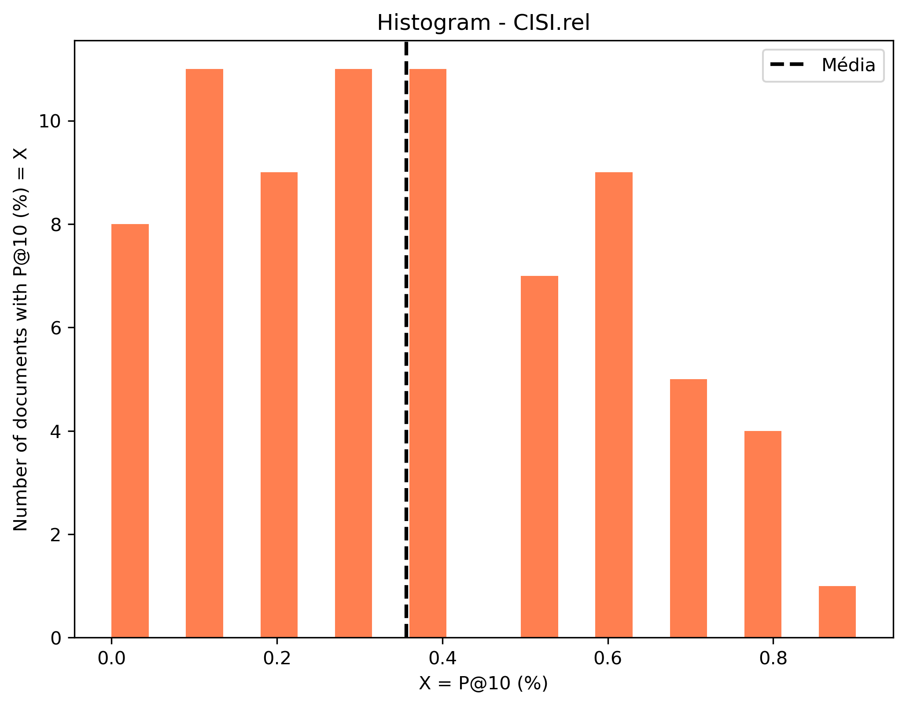
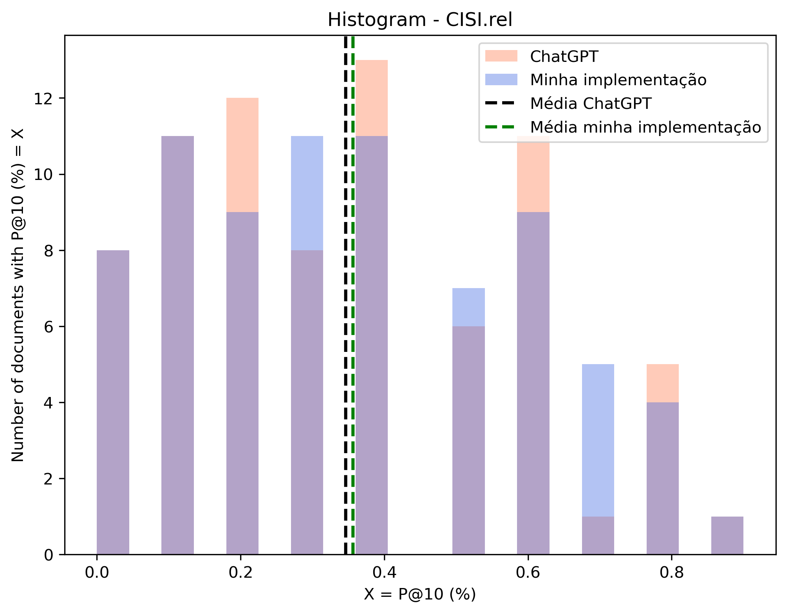

# Relatório - Building a Simple Information Retrieval System using BM25 and GPT-3 and evaluated in the CISI collection
*Leandro Carísio Fernandes, 17/2/2023*

Nesse exercício foi solicitada a construção de um sistema de recuperação de informação usando o algoritmo BM25. Os resultados devem ser avaliados na base de dados [CISI](http://ir.dcs.gla.ac.uk/resources/test_collections/cisi/) e o uso do ChatGPT é permitido e encorajado.

Este relatório descreve os detalhes de implementação do algoritmo (seção 1), resultados obtido ao testar com a coleção CISI (seção 2), como testar o sistema de recuperação de informação (seção 3) e como o ChatGPT foi usado (seção 4). As conclusões estão disponíveis na última seção (5). Além disso, está disponível a seção 0 que apresenta uma revisão de conceitos úteis (pode ser pulada caso o leitor já esteja familiarizado com o assunto).

O caderno de apoio a este relatório está disponível no [Google Colab](https://colab.research.google.com/drive/1au_hUeSkTk5u6d4Se2wZJAZqP-avW510?usp=sharing) e [aqui](./notebook/bm25-cisi.ipynb).

## 0. Revisão de conceitos

Essa seção descreve a base de dados utilizada e o algoritmo BM25.

### 0.1 Base de dados "CISI Collection"

O link fornecido [CISI](http://ir.dcs.gla.ac.uk/resources/test_collections/cisi/) contém apenas a base de dados, mas não explica seu funcionamento. São fornecidos quatro arquivos, descritos assim:

- cisi.all: Os documentos
- cisi.que: As queries
- cisi.rel: Avaliação de relevância
- cisi.bln: Uma lista de queries booleanas

Há uma descrição dessa base disponível no [Kagle](https://www.kaggle.com/datasets/dmaso01dsta/cisi-a-dataset-for-information-retrieval) e em outros links (por exemplo, [este](https://www.pragmalingu.de/docs/guides/data-comparison/), que informam que trata-se de base coletada pelo *Centre for Inventions and Scientific Information* (CISI) e que consiste de dados de texto de aproximadamente 1.460 documentos e 112 queries.

O propósito dessa base é ser usada em testes de modelos de recuperação de informação onde uma query retornará uma lista de documentos ranqueados para a query (no caso, uma lista de IDs dos documentos). Assim, além dos documentos e das queries, está disponível também uma lista de associação de query-documentos que devem ser encontrados (arquivo cisi.rel). Essa lista deve ser vista como um padrão ouro e deve ser usada nos testes para comparar o resultado de modelos com o resultado desejado.

#### 0.1.1 Formato do arquivo cisi.all

Esse é o arquivo que contém os documentos. Trata-se de arquivo texto contendo 1.460 registros. Cada registro possui informações sobre um documento (ID único, título, autor, resumo e referências cruzadas). No arquivo cisi.all, as tags .I delimitam onde começa o registro e são seguidas por um identificador único. As informações seguintes são delimitadas pelas tags .T (título), .A (autor), .W (resumo - abstract) e .X (referências cruzadas).

O texto abaixo exemplifica o início do primeiro registro dessa base:

    .I 1
    .T
    18 Editions of the Dewey Decimal Classifications
    .A
    Comaromi, J.P.
    .W
        The present study is a history of the DEWEY Decimal
    Classification.  The first edition of the DDC was published
    in 1876, the eighteenth edition in 1971, and future editions
    will continue to appear as needed.  In spite of the DDC's
    long and healthy life, however, its full story has never
    been told.  There have been biographies of Dewey
    that briefly describe his system, but this is the first
    attempt to provide a detailed history of the work that
    more than any other has spurred the growth of
    librarianship in this country and abroad.
    .X
    1	5	1
    92	1	1

A lista de referência cruzada (.X) é formada por 3 números. O primeiro e o último são IDs de registros e o segundo indica o tipo de referência, que pode ser [4, 5 ou 6](https://www.pragmalingu.de/docs/guides/data-comparison/):

- 4: 'bibliographic coupling': Os documentos possuem algumas referências em comum
- 5: 'links': Se os documentos estão linkados, então um deles cita o outro ou ambos são o mesmo documento
- 6: 'co-citations': Ambos os documentos são citados juntamente em outros documentos

#### 0.1.2 Formato do arquivo cisi.qry

O arquivo de query possui 112 registros de queries, sendo que cada registro possui apenas sua identificação (delimitada pela tag .I seguida do identificador da query) e o seu conteúdo (indicada pela tag .T). O registro abaixo mostra o conteúdo da tag de ID 1:

    .I 1
    .W
    What problems and concerns are there in making up descriptive titles?
    What difficulties are involved in automatically retrieving articles from
    approximate titles?
    What is the usual relevance of the content of articles to their titles?

#### 0.1.3 Formato do arquivo cisi.rel

Esse documento contém a resposta desejada para as queries, ou seja, para cada query ele traz uma relação de documentos relevantes para aquela query. Cada linha do arquivo é formada por 4 números, sendo o primeiro o id da query, o segundo a id do documento, o terceiro 0 (int) e o quarto 0 (float). As 5 primeiras linhas do arquivo são:

     1     28	0	0.000000
     1     35	0	0.000000
     1     38	0	0.000000
     1     42	0	0.000000
     1     43	0	0.000000

### 0.2 O algoritmo BM25

O algoritmo BM25 (best match 25) é uma função de ranqueamento de documentos. Dada uma query (um conjunto de termos de pesquisa), a idea é encontrar os documentos que mais se aproximam dela, ou seja, os documentos que possuem maior relevância considerando os termos de busca pesquisados. Considerando que a query Q possui uma lista de termos, o algoritmo calcula um score entre cada documento D e a query Q da seguinte forma [(Fonte: wikipedia)](https://en.wikipedia.org/wiki/Okapi_BM25):

$$ Q = {q_1, ..., q_n} $$

$$ score(D, Q) = \sum_{i=1}^{n} IDF(q_i) \times \frac{f(q_i, D) \times (k_1 + 1)}{f(q_i, D) + k_1 (1 - b + b \frac{|D|}{avgdl})}$$

onde:

- f(q_i, D) é a frequência que o termo q_i aparece no documento D
- |D| é o tamanho do documento D em palavras
- avgdl é o tamanho médio de um documento no corpus
- k_1 e b são parâmetros livres. [Normalmente k_1 está no intervalo [1.2, 2.0] e b = 0.75](https://en.wikipedia.org/wiki/Okapi_BM25)
- IDF(q_i), *inverse document frequency*, é calculado como:

$$ IDF(q_i) = ln \left( \frac{N - n(q_i) + 0.5}{n(q_i) + 0.5} + 1\right) = ln \left( \frac{N + 1}{n(q_i) + 0.5} \right)$$

onde:

- N é o número de documentos no corpus
- n(q_i) é o número de documentos que possui o termo q_i

O cálculo do score depende de dois fatores, o IDF e outro termo multiplicando-o.

#### 0.2.1 Interpretação do IDF

O IDF depende apenas de n(q_i), que é o número do documentos que possui o termo pesquisado q_i. Pela própria definição do termo, n(q_i) pode variar de 0 a N. É interessante analisá-lo em 3 situações críticas, quando n(q_i) é igual a 0, 1 ou N. Nessas situações o valor do IDF(q_i) é:

$$ IDF(q_i | n(q_i) = 0) = ln \left( \frac{N + 1}{0.5}\right) $$

$$ IDF(q_i | n(q_i) = 1) = ln \left( \frac{N + 1}{1.5}\right) $$

$$ IDF(q_i | n(q_i) = N) = ln \left( \frac{N+1}{N + 0.5}\right) $$

Ou seja, para um N muito grande, o IDF tende a 0 quando o termo pesquisado está presente em todos os documentos. Além disso, ele é maior quanto menor a presença do termo pesquisado nos documentos, sendo máximo quando não está presente em nenhum documento da base. Ou seja, caso o termo pesquisado esteja no documento D, o IDF atua para aumentar seu score de acordo com a raridade de documentos encontrados.

#### 0.2.2 Interpretação do termo multiplicativo

O score é calculado para determinado par documento D e query Q. Para isso, calcula-se um score para cada termo q_i da query Q. Após somados, o resultado é o score de toda a query.

Para o cálculo do score de um termo q_i, o IDF é multiplicado por um fator que depende do número de vezes que o termo aparece dentro do documento, aumentando o escore quanto mais vezes o termo aparece. Entretanto, há uma compensação para considerar o tamanho do documento. Como documentos maiores tem mais chances de ter mais ocorrências de determinada palavra, para uma mesma frequência de palavras, quanto menor o documento maior o escore.

#### 0.2.3 Interpretando o score

Dessa forma, juntando ambos os termos da equação, o score é 0 quando não há nenhum termo pesquisado e aumenta de acordo com (i) a raridade do termo pesquisado na base (quanto mais raro, melhor); (ii) o tamanho do documento (quanto menor, melhor); e (iii) a frequência em que aparece no documento (quanto mais frequente, melhor).

## 1. Detalhes de implementação

### 1.1 Leitura dos arquivos da coleção CISI

Há [código](https://www.kaggle.com/code/vabatista/introduction-to-information-retrieval/notebook) disponível no Kagle para a leitura dos arquivos. Para esse exercício, o código foi utilizado como base e alterado para fornecer uma outra estrutura de dados.

Assim, foi criada uma função *read_cisi_files()* que lê os arquivos cisi.all, cisi.qry e cisi.rel e retorna a seguinte estrutura de dados:

Para cisi.all, um dict (também chamado nesse relatório de dicionário ou mapa) indexado pela id do documento. Cada valor do dicinário é outro dicionário que contém as chaves author, title, abstract e all, este último contendo a concatenação de author, title e abstract:

    doc_set = {
        id_1 = {
            author = "...",
            title = "...",
            abstract = "...",
            all = "..."
        },
        ...,
        id_n = {
            author = "...",
            title = "...",
            abstract = "...",
            all = "..."
        }
    }

Para cisi.qry foi criado um dicionário cuja chave é a id da query e valor é a string de busca:

    qry_set = {
        id_1 = "Query 1...",
        ...
        id_n = "Query n..."
    }

Para cise.rel foi criado um dicioniário cuja chave é a id da query e valor é uma lista de ids de documentos relevantes:

    rel_set = {
        id_query_1 = [id_doc_a, ..., id_doc_b],
        ...,
        id_query_n = [id_doc_x, ..., id_doc_y],
    }

### 1.2 Implementação do algoritmo BM25

Como vimos [na seção 0.2](#02-o-algoritmo-bm25), o cálculo do score de um documento para determinada query depende de alguns fatores. Em relação as palavras da query, é necessário saber, para cada palavra, em quantos documentos aquela palavra aparece e quantas vezes essa palavra aparece em cada documento.

Obviamente não se sabe previamente quais palavras serão pesquisadas. Entretanto, sabe-se de antemão quais são os documentos do texto e, consequentemente, quais as palavras estão disponíveis na base de dados. Além disso, qualquer palavra não disponível na base de dados terá score 0, então conhecendo as palavras da base e pré-calculando algumas constantes, é possível otimizar o algoritmo.

Assim, considerando o conceito de [Corpus](https://pt.wikipedia.org/wiki/Corpus_lingu%C3%ADstico) (conjunto de textos escritos e registros orais em uma determinada língua e que serve como base de análise), optei por criar uma classe que possui os seguintes atributos:

    documents = {
        id_doc_1: {
            n_words: number,
            counter: Counter
        },
        ...
        id_doc_n: {
            n_words: number,
            counter: Counter
        }
    }
    ...
    idf = {
        word_1: number,
        word_2: number,
    },
    idf_not_found: number,
    unique_words = list of words
    N = number,
    avgdl = number

Nesta classe, _documents_ é um dicionário indexado pela chave de cada documento. Nesse ponto não precisamos guardar todo o documento, apenas as questões relevantes em relação a ele. No caso do BM25, é necessário saber o tamanho de cada documento (_n_words_) e um _Counter_ para cada palavra daquele documento.

Para a extração das palavras (tokens) do documento é necessário um pré-processamento que pode ou não passar pelos seguintes passos (depende da implementação):

1. remoção de pontuação
2. remoção de caracteres não alfanuméricos
3. capitalização do texto (converter para minúsculo ou maiúsculo)
4. remoção de _stop words_
5. extração de radicais (uso de stemmers)
6. criação de n-gramas

Dessa lista os 3 primeiros itens são auto-explicativos. Em relação às _stop words_, foram desconsideradas todas as palavras com 3 letras ou menos. Além disso, foi utilizada uma lista enxuta com algumas palavras comuns da língua inglesa ("this", "that", "there", "their", "what", "whose", "whom", "about", "almost", "always", "although", "because", "could", "either", "hence", "have").

Em relação à extração de radicais, como sua implementação é muito complicada e muito dependente da língua, optei por utilizar o _PorterStemmer_ da biblioteca _nltk_. Essa foi a única biblioteca externa no contexto do BM25 utilizada neste trabalho.

Quanto aos n-gramas, para essa base de dados ela não trouxe ganhos. Por isso, embora esteja implementada, está desabilitada (comentada) no código.

Ainda relacionada a _documents_, essa classe guarda _N_, o número total de documentos no corpus, _avgdl_, o tamanho médio em palavras de cada documento e _unique_words_, uma lista de palavras únicas presentes em todos os documentos. Essa lista não é necessária, sendo deixada aqui apenas para _debug_.

Além desses atributos, a classe _Corpus_ provê o dicionário _idf_ que mostra, para cada palavra de _unique_words_, qual é o IDF calculado. É fornecido também um _idf_not_found_ com o valor teórico do IDF caso seja uma palavra não disponível na base. Entretanto, nesses casos o valor do score é 0 e, por isso, na prática esse valor é indiferente.

A partir dessa estrutura, o cálculo do score para cada documento é simples. Basta realizar o mesmo pré-processamento da query e calcular seguindo a equação do BM25. Para isso foram implementada a função _score_corpus()_:

    def score_corpus(corpus, query_string, k_1, b, use_stemmer = True)

Essa função aceita como parâmetro o corpus armazenado na classe _Corpus_, uma string de busca (_query_string_) e os parâmetros _k_1_ e _b_, constantes usadas no BM25. Também é fornecido um parâmetro _use_stemmer_ para indicar se o stemmer deverá ser utilizado ou não.

## 2. Resultados

Para gerar os resultados, primeiro é necessário ler os arquivos da base, definir o Corpus e os parâmetros k_1 e b:

    # Lê os arquivos CISI
    doc_set, qry_set, rel_set = read_cisi_files()
    
    # Cria o corpus
    corpus = Corpus(doc_set)

    # Define parâmetros k_1 e b
    k_1, b = 1.2 , 0.75

Em seguida, basta chamar a função _score_corpus(corpus, query, k_1, b)_ passando alguma string de busca no parâmetro _query_. Por exemplo, para essa base de dados a última query do arquivo cisi.rel é a query de ID 111. Para encontrar os 10 primeiros documentos relevantes desse código, fazemos:

    score_corpus(corpus, qry_set[111], k_1, b)[0:10]
    Output: [(448, 69.00235899878709),
            (570, 64.00533754562827),
            (635, 63.137535659697505),
            (566, 61.615747459936316),
            (485, 61.366390599827135),
            (422, 56.3605499926944),
            (576, 56.13254186282193),
            (509, 49.72344676310337),
            (483, 47.20112855265488),
            (608, 44.8691670777068)]

De acordo com o arquivo cisi.rel, essa query tem os seguintes documentos relevantes: 328, 422, 448, 485, 503, 509. Desses, 4 foram encontrados (422, 448, 485 e 509) nas primeiras 10 posições.

## 3. Testes na base CISI

Para avaliar os resultados em toda a base CISI, vamos considerar a métrica [_precision at 10_ (P@10)](https://en.wikipedia.org/wiki/Evaluation_measures_(information_retrieval)), que corresponde ao número de resultados relevantes nas 10 primeiras posições. Para facilitar a visualização, vamos considerar esse valor em termos percentuais. Assim, se 7 documentos relevantes forem encontrados nas primeiras 10 posições (P@10 = 7), podemos calcular P@10 (%) como 7/10 = 70%.

Considerando que essa base é muito pequena e que há casos (como a query 111 acima) em que não há 10 documentos relevantes, o denominador do P@10 (%) será adaptado para considerar essa situação, ou seja, P@10 (%) = número de documentos relevantes encontrados nas primeiras 10 posições do ranking dividido pelo mínimo entre 10 e número de documentos relevantes para a query.

O histograma abaixo mostra o P@10 (%) calculado para todas as queries disponíveis no arquivo cisi.rel. A média é 0.362, o que indica que essa implementação retornou, em média, 3,62 documentos relevantes entre os 10 primeiros.

## 4. Uso do ChatGPT

Inicialmente, tentei pedir pro ChatGPT gerar de uma única vez todo o fluxo completo deste exercício (gerar um algoritmo em que usa BM25 para ranqueamento para tratar a coleção CISI). Entretanto, não consegui ser 100% bem sucedido nessa tarefa. Alguns dos empecilhos encontrados nessa tarefa foram:

- Em relação a leitura dos arquivos de entrada, às vezes ele gerava códigos que considerava que os arquivos da coleção CISI estavam em outro formato. Por exemplo, uma linha pra ID e todo o corpo na linha seguinte ou até mesmo em formato json.
- Ainda no carregamento dos arquivos, as vezes ele gerava uma chamada a nltk.download('cisi') que gerava erro e uma pesquisa no Google não identificou isso como uma chamada válida.
- Quanto à implementação, o ChatGPT tentou gerar uma implementação usando bibliotecas externas que muitas vezes não funcionavam sem ajustes (por exemplo, tentou usar gensim.summarization, mas esse pacote foi removido das versões mais recentes). Mesmo quando usava pacotes corretos, são pacotes que são necessários instalar e dificultariam o uso.

Assim, abandonei essa ideia e dividi o problema em dois: (1) gerar casos de teste e (2) gerar um algoritmo de ranqueamento que usa BM25 (mas sem a restrição de ser aplicada a algum problema em específico).

### 4.1 Gerando casos de teste

[Nesta conversa](./notebook/conversa_chat_gpt_gerar_casos_teste.txt), solicitei uma lista fictícia de 10 documentos e 5 queries que eu poderia usar para testar o algoritmo. Em seguida, solicitei quais os documentos relevantes para cada query. A resposta foi:

| ID documento | Documento no formato (Título): texto |
|--------------|-----------|
| 1            |  (The Benefits of Regular Exercise): "Regular exercise has been shown to have many benefits for both physical and mental health. It can help you maintain a healthy weight, reduce your risk of chronic diseases like heart disease and diabetes, and improve your mood and cognitive function"         |
| 2            | (How to Build a Birdhouse) "Building a birdhouse is a fun and rewarding project that can be completed in just a few hours. All you need is some basic woodworking tools and materials, and you'll have a cozy home for your feathered friends in no time."        |
| 3            | (The History of the Internet): "The internet has revolutionized the way we live, work, and communicate. But where did it all begin? In this article, we'll take a look at the history of the internet, from its humble beginnings as a military communication tool to the ubiquitous global network we know today."        |
| 4            | (5 Easy Vegetarian Recipes): "Eating a vegetarian diet has many health benefits, but it can be challenging to find delicious and satisfying meals. Here are five easy vegetarian recipes that are sure to please even the most dedicated carnivore."         |
| 5            | (The Basics of Investing): "Investing your money wisely is essential for long-term financial success. But where do you begin? In this article, we'll cover the basics of investing, including stocks, bonds, and mutual funds, so you can make informed decisions about your money."        |
| 6            | (The Top 10 Tourist Attractions in Paris): "Paris is one of the most popular tourist destinations in the world, and with good reason. From the Eiffel Tower to the Louvre Museum, there's no shortage of amazing sights to see in the City of Light. Here are the top 10 tourist attractions in Paris."          |
| 7            | (The Benefits of Meditation): "Meditation has been practiced for thousands of years, and for good reason. It can reduce stress and anxiety, improve sleep, and even lower blood pressure. In this article, we'll explore the benefits of meditation and how you can get started with your own practice."           |
| 8            | (The Rise of E-Commerce): "Online shopping has become a global phenomenon, with more and more people turning to e-commerce for their shopping needs. In this article, we'll look at the rise of e-commerce and the ways it's changing the retail industry."          |
| 9            | (10 Tips for Better Sleep): "Getting a good night's sleep is essential for physical and mental health, but it's not always easy. If you're struggling to get the rest you need, try these 10 tips for better sleep."           |
| 10           | (How to Make the Perfect Cup of Coffee): "For coffee lovers, there's nothing better than a perfectly brewed cup of joe. But what's the secret to making the perfect cup? In this article, we'll walk you through the steps to brewing the perfect cup of coffee."          |

| ID query | Texto da query |
|--------------|-----------|
| 1            | How do I build a birdhouse?       |
| 2            | What are the benefits of regular exercise?         |
| 3            | What are the top tourist attractions in Paris?         |
| 4            | How do I invest my money?         |
| 5            | What are some easy vegetarian recipes?         |

A tabela abaixo mostra, para cada query, o ranking de relevância dos 10 documentos indicados pelo ChatGPT e pelo algoritmo implementado:

| ID query |               | Ranking |
|----------|---------------|---------|
| 1        | ChatGPT       | [**2**, 10, 1, 5, 9, 8, 7, 6, 4, 3]        |
|          | Implementação | [**2**, 1, 3, 4, 5, 6, 7, 8, 9, 10]        |
| 2        | ChatGPT       | [**1**, 7, 5, 4, 9, 2, 6, 10, 8, 3]        |
|          | Implementação | [**1**, 7, 4, 2, 3, 5, 6, 8, 9, 10]        |
| 3        | ChatGPT       | [**6**, 5, 1, 7, 4, 9, 8, 3, 2, 10]        |
|          | Implementação | [**6**, 1, 2, 3, 4, 5, 7, 8, 9, 10]        |
| 4        | ChatGPT       | [**5**, 7, 1, 9, 6, 2, 8, 4, 10, 3]        |
|          | Implementação | [**5**, 1, 2, 3, 4, 6, 7, 8, 9, 10]        |
| 5        | ChatGPT       | [**4**, 1, 7, 9, 5, 2, 6, 8, ?, ?]        |
|          | Implementação | [**4**, 2, 9, 1, 3, 5, 6, 7, 8, 10]        |

Obs.: note que o algoritmo parou de gerar resultados após o oitavo documento da última query.

Note que, apesar da lista de resultados sugerida ser totalmente diferente do resultado obtido, o primeiro documento indicado como mais relevante pelo ChatGPT foi o mesmo que o indicado pelo algoritmo implementado.

Como o próprio ChatGPT informa na sua resposta gerada a ordenação vai depender da implementação de cada algoritmo ("note that the rankings may vary depending on the implementation of your BM25 algorithm"). Por isso, o próximo passo foi pedir uma implementação do BM25 para aplicar em toda a base de dados e comparar os resultados.

### 4.2 Gerando um algoritmo que usa BM25 para ranqueamento de documentos

[Nesta conversa](./notebook/conversa_chat_gpt_gerar_algoritmo.txt) solicitei a implementação de um algoritmo. A ferramenta propôs a implementação do algoritmo e como utilizá-lo. Com isso, foi possível checar o resultado das queries com a implementação feita neste trabalho.

Inicialmente essa checagem foi feita com um único caso, a query 111. Os resultados para os 10 primeiros registros do ranking estão disponíveis na tabela abaixo:

| Ranking (minha implementação) | Score (minha implementação)   | Ranking (Chat GPT) | Score (ChatGPT)                   |
|-----------|---------------------|-----|--------------------|
| 448       | 69.00235899878709   | 448 | 62.11190942915783  |
| 570       | 64.00533754562827   | 570 | 61.358368942879075 |
| 635       | 63.137535659697505  | 635 | 57.10510292584185  |
| 566       | 61.615747459936316  | 485 | 56.28145345633532  |
| 485       | 61.366390599827135  | 566 | 55.407889328538026 |
| 422       | 56.3605499926944    | 422 | 50.75734726295538  |
| 576       | 56.13254186282193   | 576 | 50.38227137934702  |
| 509       | 49.72344676310337   | 509 | 43.52151839928218  |
| 483       | 47.20112855265488   | 483 | 43.037698238534105 |
| 608       | 44.8691670777068    | 608 | 39.63068983936048  |

Podemos observar que, exceto pelos documentos 566 e 485, a ordem dos documentos retornados é o mesmo. O score também possui a mesma ordem de grandeza. Esses fatos indicam que a implementação do ChatGPT foi bem próxima a que foi feita neste trabalho. Após comparação do código, é possível ver que a diferença se deve ao cálculo do IDF. Enquanto neste trabalho [usei esta fórmula](https://en.wikipedia.org/wiki/Okapi_BM25)

$$ IDF(q_i) = ln \left( \frac{N - n(q_i) + 0.5}{n(q_i) + 0.5} + 1\right) $$

, o ChatGPT implementa esta:

$$ IDF(q_i) = ln \left( \frac{N - n(q_i) + 0.5}{n(q_i) + 0.5}\right) $$

Ou seja, há uma diferença no argumento do logaritmo neperiano (+1), o que justifica o fato do score calculado aqui sempre ser maior que o score calculado pela implementação do ChatGPT.

Se adicionarmos + 1 a implementação do ChatGPT ou removermos esse +1 da implementação feita aqui, o resultado passa a ser idêntico. Mas, em vez de ajustar essa diferença, vamos calcular o P@10 (%) na CISI collection e comparar os resultados da implementação do ChatGPT com a feita anteriormente:

O histograma abaixo mostra o P@10 (%) calculado para todas as queries disponíveis no arquivo cisi.rel usando a formulação da wikipedia (média 0.362) e a formulação do ChatGPT (média 0.352). Há pouca diferença entre os resultados.

Para essa base de dados e esses parâmetros (k_1 = 1.2 e b = 0.75), a formulação do IDF adicionando +1 ao parâmetro do log é mais interessante. Entretanto, não é possível generalizar essa conclusão para outras bases de dados e parâmetros.

## 5. Conclusões

Este trabalho foi desenvolvido para a pré-selecão da disciplina "Deep Learning aplicado a sistemas de buscas". Foi solicitado a implementação de um algoritmo BM25 e sua aplicação à coleção CISI. O uso do ChatGPT foi permitido e encorajado.

Como o objetivo final é o aprendizado de conceitos, foquei inicialmente no entendimento do BM25 e na sua implementação usando as fórmulas disponíveis na Wikipedia. Para o teste do algoritmo, foram feitos cálculos manuais comparando uma base de cinco documentos com frases simples. Em seguida, executei todas as queries disponibilizadas e comparei com os resultados esperados.

Após esse procedimento, o ChatGPT foi utilizado para gerar 10 documentos de testes fictícios em inglês. Além disso, o ChatGPT sugeriu 5 queries e apresentou a ordenação daqueles 10 documentos segundo as queries sugeridas. Nessa ocasião foi possível testar novamente o algoritmo, mas dessa vez com uma base de 10 documentos. Apesar da ordenação dos documentos ter sido bem diferentes, nos cinco casos analisados o primeiro documento retornado como mais relevante na implementação realizada foi o mesmo que o primeiro documento retornado como relevante pelo ChatGPT.

Por último, o ChatGPT foi utilizado para gerar um código de ranqueamento seguindo o BM25. Em seguida, testado com toda a coleção CISI. Os resultados foram muito semelhantes ao código implementado, diferindo apenas em relação à implementação do IDF: Enquanto o IDF implementado é ln(func(q_i) + 1), onde func(q_i) é uma função que depende da frequência do termo na coleção de documentos, o IDF sugerido pelo ChatGPT não possui o termo aditivo (+ 1). O efeito disso nessa base foi pequeno, reduzindo em 1 ponto percentual a métrica utilizada (equivalente a uma piora de menos de 3%).

Mais do que otimização de código, o objetivo final aqui é o aprendizado de conceitos. Por isso, optei por não focar demasiadamente na otimização do algoritmo implementado, nem em reduzir demais o código. Por isso, após a conclusão deste relatório foram identificadas algumas oportunidades de melhoria, o que poderia ser feito se o intuito fosse a implementação de uma versão final desse algoritmo para uso por outras pessoas. Apenas para enumerar algumas oportunidades de melhoria:

- Apesar de ter sido criada uma classe _Corpus_, ela foi utilizada apenas para o cálculo do IDF e algumas outras questões relacionadas ao documento. A implementação do BM25 em si foi feita por uma função auxiliar (_score_corpus_). Há diversas oportunidades de melhoria nessa organização do código como, por exemplo, a questão do pré-processamento dos documentos e das queries (do jeito que está o código hoje, o usuário pode esquecer de pré-processar a query da mesma forma que os documentos são pré-processados).

- Os parâmetros k_1 e b foram usados aqui com os valores de 1.2 e 0.75. Testei diversos valores e estes se mostraram mais adequados para essa base. Entretanto poderia ter sido feita uma busca mais intensa para a otimização desses parâmetros.

- Há diversos "sabores" do BM25 sendo que neste trabalho apenas uma versão foi implementada. Há oportunidade aqui também, outros modelos poderiam ser testados.

- O pré-processamento tem uma influência muito grande no resultado final, e as decisões aqui de pré-processamento do texto envolveram apenas a remoção manual de algumas stopwords e o uso do Porter Stemmer. Há diversas bases de stopwords que poderiam ser testadas, assim como também há outros stemmers que poderiam ser testados.

- Ainda em relação ao pré-processamento, há oportunidades de melhorias no tratamento de n-gramas e no peso das informações. Por exemplo, neste exercício o conteúdo do documento considerou apenas as tags author, abstract e title, ambas com pesos 1. Ao dar um peso 2 para o título há uma ligeira melhora nos resultados (< 0.5 p.p.).

- Além do P@10, há possibilidades de testar outras métricas, inclusive testando outros valores de k_1 e b para a otimização delas.